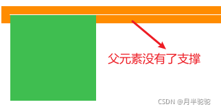
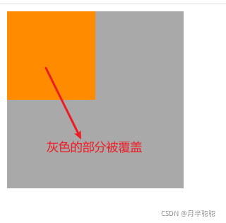

BFC--块级格式化上下文
==
> create by **yuzhoufen** on **2019-09-19 15:45**

### 1. 概念
> 直译为 块级格式化上下文 ，把BFC理解成一块独立的渲染区域，BFC看成是元素的一种属性， 当元素拥有了BFC属性后，这个元素就可以看做成隔离了的独立容器。容器内的元素不会影响容器外的元素.

* 理解为：将BFC看成是一种属性，当拥有该属性的元素就相当于一块独立的区域。
### 2. 实现BFC属性的方法：
1. 浮动元素，float 除 none 以外的值
2. 定位元素，position为absolute、fixed、sticky；position的值不是static或者relative。
3. display 为 inline-block 、table-cell、table-caption、table、table-row、table-row-group、
        table-header-group、table-footer-group、inline-table、flow-root、flex或 inline-flex、grid或 inline-grid
4. overflow 除了 visible 以外的值（hidden，auto，scroll）
5. 根元素html 就是一个 BFC
6. display: flow-root 或者flow-root list-item

**推荐使用 display: flow-root ，没有副作用**
### 3. BFC布局规则
1. 内部的Box会在垂直方向，一个接一个地放置。
2. Box垂直方向的距离由margin决定。属于同一个BFC的两个相邻Box的margin会发生重叠
3. 每个元素的margin box的左边， 与包含块的左边缘相接触(对于从左往右的格式化，否则相反)。即使存在浮动也是如此。

* 在一个bfc中，每一个盒子的左外边距应该和包含块的左边接触。这句话有两个地方值得注意
  * 第一、 bfc中的盒子应该与其自身的包含块相接触，而非与bfc盒子相接触，这个包含块有可能是bfc中的一部分，也有可能和bfc无关。

  * 第二、bfc中的盒子是与其包含块的 left edge 相接触，而不是包含块的left-border相接触。因为包含块并非一个完整的盒子，不可能有left-border。 left edge 正确的翻译为左边缘。
* 第二句翻译：即使存在浮动盒子也应该如此（如此的意思就是布局应该按照上述的规则进行），除非子盒子又形成了一个新的bfc。

  * 这句话正确的理解方式为，一个bfc中，如果存在一个浮动的盒子，而其他盒子并没有形成新的bfc，那么所有的子盒子都应该触碰到其包含块的左边缘。举个例子，一个父盒子使用overflow:hidden形成bfc，其中有个子盒子，一个浮动，另一个不浮动。那么浮动盒子会盖住不浮动盒子，但是两个盒子都会触碰到bfc的content-box。

4. BFC的区域不会与float box重叠。

5. BFC就是页面上的一个隔离的独立容器，容器里面的子元素不会影响到外面的元素。反之也如此。

6. 计算BFC的高度时，浮动元素也参与计算

### 4. BFC的作用
1. 用于清除浮动
2. 避免外边距重叠（防止margin塌陷）
3. 阻止元素被浮动元素覆盖

* 例1 用于清除浮动
 
```
<head>
<style>
body {
  background-color: lightblue;
}

.fa{
	width:400px;
    border:1px solid;    
    //添加bfc属性实现计算浮动高度overflow:hidden;position:absolute;
    
}
.son1{
	background-color:red;
    width:100px;
    height:100px;
    float:left;
}
.son2{
	background-color:green;
    width:100px;
    height:100px;
    float:right;
}
</style>
</head>
<body>
<div class="fa">
	<div class="son1"></div>
    <div class="son2"></div>
</div>
</body>
```
* 例2 避免外边距重叠（防止margin塌陷）
    * 通过给其中一个div包裹一个父div，设置BFC属性，来解决margin塌陷的问题
>>margin塌陷的意思：同时给两个div设置相同的属性，当设置margin为100px，那么两个div之间的间隙应该是margin-bottom+margin-top=200px的外边距，但是没有设置BFC属性，块的上外边距和下外边距会合并为单个边距，取最大值，如果margin相等，则仅为一个，这就是外边距重叠（margin塌陷）
    

```
<style>
body {
  background-color: lightblue;
}
 .container {
        overflow: hidden;
      }
      .cube {
        width: 100px;
        height: 100px;
        background-color: blueviolet;
        margin: 100px;
      }
</style>

<body>
    <!-- 外边距重叠 -->
    <div class="container">
      <div class="cube"></div>
    </div>
    <div class="cube"></div>
</body>
```
* 例3阻止元素被浮动元素覆盖，实现两栏自适应
  * 当前一个兄弟元素设置了浮动属性时，后一个兄弟元素会跑到前一个兄弟元素的位置去，从而后一个兄弟元素被覆盖。
  * 第二个兄弟元素被覆盖的情况
  
  *  通过给被影响的兄弟元素设置BFC属性，来解决被覆盖的情况。
  ```
  <head>
  <style>
      .cube1 {
        width: 100px;
        height: 100px;
        background-color: darkorange;
        float: left;
      }
      /* 通过给被影响元素设置overflow: hidden;属性，将其设置BFC属性，实现阻止被浮动元素影响 */
      .cube2 {
        width: 200px;
        height: 200px;
        background-color: darkgrey;
        overflow: hidden;
      }
    </style>
  </head>
  <body>
    <div class="cube1"></div>
    <div class="cube2"></div>
  </body>
  ```