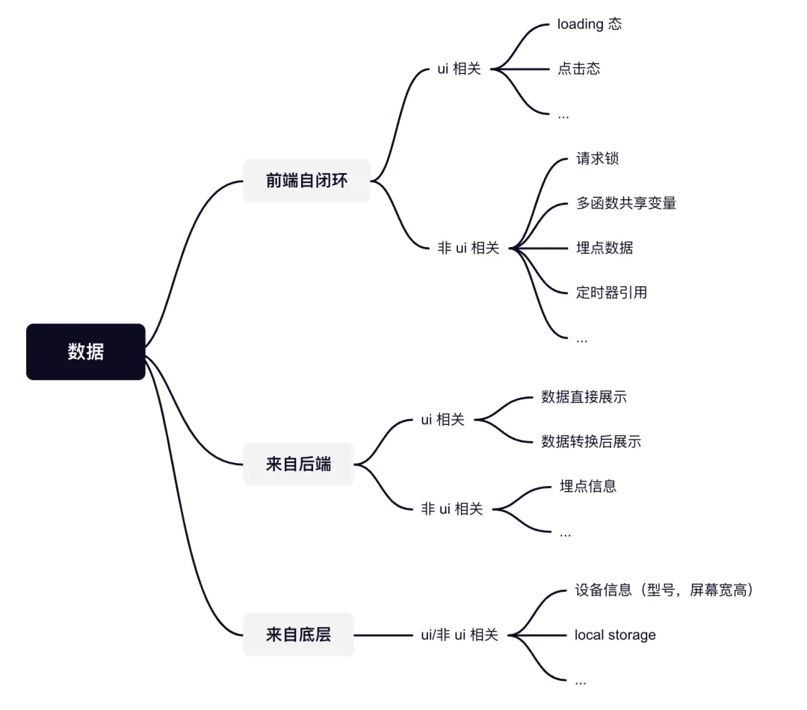
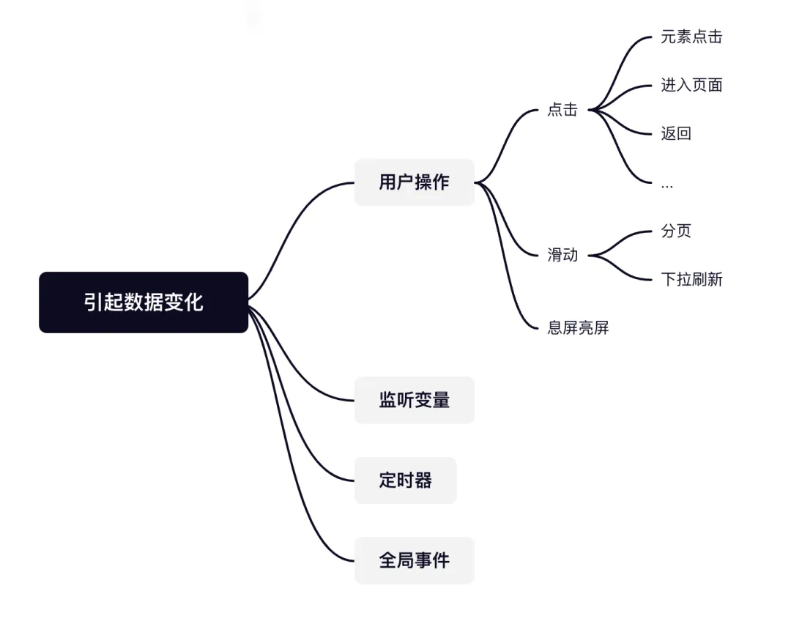
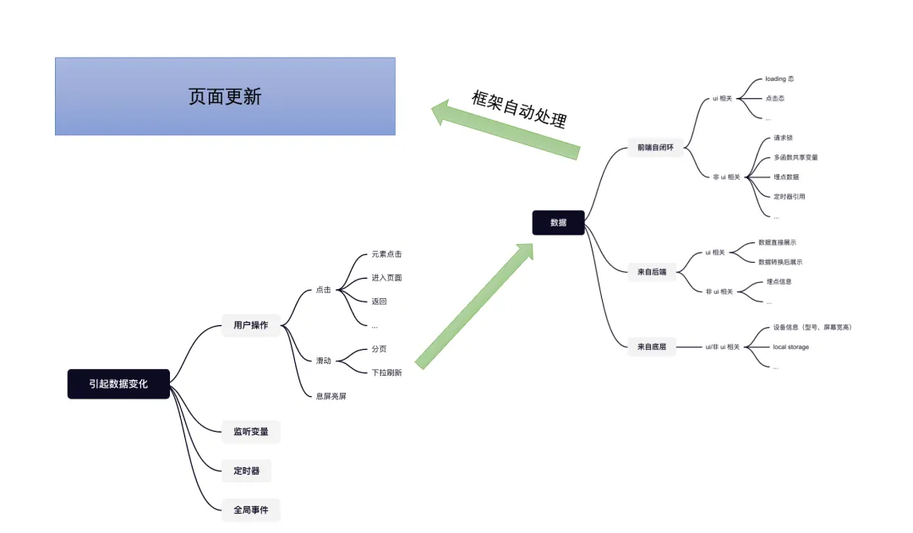

## 一、数据 

 数据主要有两大类，**ui 相关**和**非 ui 相关**。 

### 1、ui 相关 ----- 

前端本质上就是将数据可视化，因此定义的变量中一部分就是供页面展示使用的，在 Vue 中会把这些数据定义在 data 中变为响应式，在 React 中会调用 `SetState`  来更新这些变量以便更新视图。

#### 1.1 前端自闭环 一

些变量仅在前端记录进行 ui 的更新，后端不会感知到。 比如页面的 loading 态、 点击态、是否打开展示更多
#### 1.2. 来自后端 
页面数据是存在数据库中，后端会把这些数据给前端，供前端展示，这类数据又分为两种：

* 将数据直接赋值给某个前端变量进行展示，比如昵称、标题等。    
* 将数据转换后再进行展示，比如钱相关字段因为精度问题，后端存储的是分，给到前端以后需要转换成元进行展示。    

#### 1.3.来自底层 
设备信息：通过屏幕宽高来设置弹窗的宽高。

 localStorage：一些模块可能一天只需要展示一次，前端将标志存到 localStorage 中自行进行判断。

### 2、非 ui 相关 ------- 
这些变量和 ui 无关也不会和页面后端交互，举几个例子： 
#### 2.1.前端自闭环
请求锁：一些提交请求，为了防止用户多次提交，可以在接口请求前设置一个标志位，类似于下边这样。 

``` // 用于保存请求状态的标志位   
let isSubmitting = false;      
// 模拟一个异步请求    
function sendRequest() {
	return new Promise((resolve, reject) => {       
		setTimeout(() => {         
			resolve("请求成功");        }, 2000); // 模拟2秒的请求时间    
    	});   
}      // 处理按钮点击事件   

function handleSubmit() {     // 检查标志位     
     if (isSubmitting) {       
     console.log("请求正在进行中，请稍后...");      
     return;     
	}        // 设置标志位     
	isSubmitting = true;     
    console.log("开始请求...");        
    // 发送请求    
    sendRequest().then(response => {      
    	console.log(response);     
    }).catch(error => {     
         console.error(error);     
    }).finally(() => {    
    	// 请求完成后重置标志位       
    	isSubmitting = false;      
    	console.log("请求完成，可以再次提交");    
    });  
 }   
```
埋点数据：模块曝光或者用户点击的时候进行埋点，相关数据会提前存到一个对象中。 定时器引用：页面中创建定时器后用一个变量保存定时器实例，用户可能离开页面的时候还未执行到定时器，因此需要在离开页面的时候进行清除。
``` 
Page({    
	data: {     
		// 其他数据    
	},        
	// 用于保存定时器实例的变量    
	timer: null,       // 页面加载时创建定时器   
	onLoad: function() {    
		this.createTimer();    
	},       // 创建定时器的方法    
	createTimer: function() {    
		this.timer = setTimeout(() => {    
		console.log('定时器执行中...');     }, 5000); // 5秒后执行   
	},       // 页面卸载时清除定时器   
	onUnload: function() {    
		this.clearTimer();    
	},       // 清除定时器的方法    
	clearTimer: function() {   
		if (this.timer) {     
			clearTimeout(this.timer);      
			console.log('页面即将卸载，定时器已清除');    
		}    
	},       
	// 其他页面方法和事件处理函数 
});   
```

#### 2.2 来自后端
埋点数据：模块曝光或者用户点击的时候进行埋点，一些数据会由后端给到。
#### 2.3 来自底层 
localStorage：比如存储用户的点击次数，进行相应的限频。 

## 二、引起数据的变化 

数据变化的根源就是**用户操作**，用户的操作可能直接引起数据变化，也可能触发某些全局事件或者定时器，又触发新一轮的页面数据变化。  

### 1.用户操作
大部分的数据变化都是由于用户的操作，比如点击、滑动。 根据点击的位置不同，可能触发不同的动作。比如去请求后端接口拿数据、进入新页面、离开当前页面，在小程序中会触发 `onHide` 、`onShow`  生命周期，在这些周期中会做一些动作更新数据。 还有经常遇到的表单逆向操作，当用户依次填了 A 项、B 项、C 项，由于 B、C  依赖于 A 项的选择，当用户再修改 A 项的时候需要清空 B、C 之前的选择。

####  2.监听数据变化

在 `Vue` 中通过 `watch` 监听变量，在 `React` 中通过 `useEffect` 监听变量。一般情况监听的是组件的 prop，当父组件变化时，子组件进行相应的更新。 

#### 3.定时器 

定时器时间结束后，会触发定时器注册的回调函数。 常用于页面上的倒计时的更新。也用于解决 ui 更新的时序问题，直接给 setTimeout 事件设置为 0，让回调函数到下一个宏任务周期去执行。 

#### 4.全局事件

主要用于跨模块之间的通信，常用的比如 eventbus、vuex、redux 等。 常见的比如全局的登录事件，各个页面需要监听登录成功才去触发后续的业务逻辑。 

### 三、关联 

理想状态，用户动作 => 更新数据 => 页面自动更新。  但实际上，当数据变化的时候，由于全局事件、定时器的存在，还会继续触发新一轮的数据更新。 此外，数据变化每次也不止变更一个数据，数据之间又会有相应的联动关系。  

这也是为什么框架都在倡导单一数据流的原因，全局事件第一个人用起来会很方便，但在一个上百人的前端项目中，后续页面继续迭代或者重构的时候，漏改或者影响面评估错误的风险也会增高。 

当增加一个数据变量的时候也要考虑清楚，是否有必要新增，因为每增一个都会增加页面的内部复杂度。当然有时候也不是变量越少越好，当各个地方共用一个变量，也意味着这个变量赋予了多重含义，有悖「单一职责」。

### 总结 

业务前端看起来简单，就是维护一些数据。但当页面数据变量越来越多，交互越来越多，数据更新会变得错综复杂，后续迭代的心智负担会越来越重。

 此时能做的就是明确**当前数据（ui/非 ui 数据）有什么，引起数据的变化有什么（用户动作、数据之间的关联等）**，这些理清之后出现 bug 的概率也会极大降低。

 最根本的还是降低函数和函数之间、模块与模块之间的依赖关系，也就是常说的高内聚、低耦合，保证后续改动的影响面足够小且明确。

 最终看到的页面不再是页面，而是数据的变化和流动。