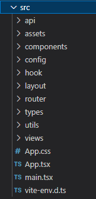

### 1 目录结构定义



### 2 路由定义

#### 1. Api 路由定义

* router.tsx

```tsx
import { Navigate, createHashRouter, createBrowserRouter } from 'react-router-dom';
import Login from '@/views/Login';
import Welcome from '@/views/Welcome';
import Error404 from '@/views/404';
import Error403 from '@/views/403';

const router = [
  {
    path: '/',
    element: <Welcome />
  },
  {
    path: '/login',
    element: <Login />
  },
  {
    path: '*',
    element: <Navigate to='/404' />
  },
  {
    path: '/404',
    element: <Error404 />
  },
  {
    path: '/403',
    element: <Error403 />
  }
];

export default createBrowserRouter(router);
```

* App.tsx

```tsx
import { BrowserRouter, RouterProvider } from 'react-router-dom';
import Router from './router/index';
import './App.css';

function App() {
  return <RouterProvider router={Router} />;
}

export default App;
```

#### 2. 组件路由定义

* router.tsx

```tsx
import { Navigate, useRoutes } from 'react-router-dom';
import Login from '@/views/Login';
import Welcome from '@/views/Welcome';
import Error404 from '@/views/404';
import Error403 from '@/views/403';

const router = [
  {
    path: '/',
    element: <Welcome />
  },
  {
    path: '/login',
    element: <Login />
  },
  {
    path: '*',
    element: <Navigate to='/404' />
  },
  {
    path: '/404',
    element: <Error404 />
  },
  {
    path: '/403',
    element: <Error403 />
  }
];

export default function Router() {
  return useRoutes(router);
}
```

* App.tsx

```tsx
import { BrowserRouter } from 'react-router-dom';
import Router from './router/index';
import './App.css';

function App() {
  return (
    <BrowserRouter>
      <Router />
    </BrowserRouter>
  );
}

export default App;

```

#### 3. 附加页面实现

##### NotFound 404

```tsx
import { Result, Button } from 'antd';
import { useNavigate } from 'react-router-dom';

function NotFound() {
  const navigate = useNavigate();
  const handleClick = () => {
    navigate('/');
  };
  return (
    <Result
      status={404}
      title='404'
      subTitle='抱歉，您访问的页面不存在'
      extra={
        <Button type='primary' onClick={handleClick}>
          回首页
        </Button>
      }
    />
  );
}

export default NotFound;
```

##### NotRight 403

```tsx
import { Result, Button } from 'antd';
import { useNavigate } from 'react-router-dom';

function NotRight() {
  const navigate = useNavigate();
  const handleClick = () => {
    navigate('/');
  };
  return (
    <Result
      status={403}
      title='403'
      subTitle='抱歉，您当前没有权限访问此页面'
      extra={
        <Button type='primary' onClick={handleClick}>
          回首页
        </Button>
      }
    />
  );
}

export default NotRight;
```