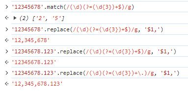
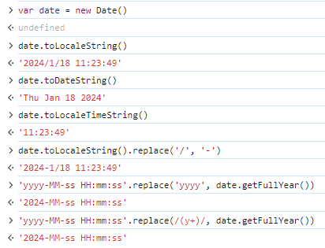

### 9 金额格式化

#### 1. 方案一

[mdn toLocaleString](https://developer.mozilla.org/zh-CN/docs/Web/JavaScript/Reference/Global_Objects/Number/toLocaleString)

* utils > index.ts

```ts
export const formatMoney = (num: number | string) => {
  const a = parseFloat(num.toString());
  return a.toLocaleString('zh-CN', { style: 'currency', currency: 'CNY' });
};

formatMoney(123123123123888); // ¥123,123,123,123,888.00
```

#### 2. 方案二

`exp1(?=exp2)`：查找 exp2 前面的 exp1



* utils > index.ts

```ts
export const formatNumber = (num: number | string) => {
  const a = num.toString();
  if (a.indexOf('.') > -1) return a.replace(/(\d)(?=(\d{3})+\.)/g, '$1,');
  return a.replace(/(\d)(?=(\d{3})+$)/g, '$1,');
};

formatNumber(123123123) // '123,123,123'
formatNumber(123123123.12) // '123,123,123.12'
```

### 10 日期格式化

#### 1. 方案一

[mdn Date](https://developer.mozilla.org/zh-CN/docs/Web/JavaScript/Reference/Global_Objects/Date)

* utils > index.ts

```ts
export const toLocalDate = (date?: Date, rule?: string) => {
  let curDate = new Date();
  if (date) curDate = dete;
  if (rule === 'yyyy-MM-dd') return curDate.toLocaleDateString();
  if (rule === 'HH:mm:ss') return curDate.toLocaleTimeString();
  return curDate.toLocaleString().replaceAll('/', '-');
};

toLocalDate() // 2024-1-18 11:13:54
```

#### 2. 方案二



* utils > index.ts

```ts
export const formatDate = (date?: Date, rule?: string) => {
  let curDate = new Date();
  if (date) curDate = date;

  let fmt = rule || 'yyyy-MM-dd HH:mm:ss';
  fmt = fmt.replace(/(y+)/, curDate.getFullYear().toString());
  type oType = {
    [key: string]: number;
  };
  const o: oType = {
    'M+': curDate.getMonth() + 1,
    'd+': curDate.getDate(),
    'H+': curDate.getHours(),
    'm+': curDate.getMinutes(),
    's+': curDate.getSeconds()
  };
  for (const k in o) {
    const val = o[k].toString();
    fmt = fmt.replace(new RegExp(`(${k})`), ('00' + val).substring(val.length));
  }
  return fmt;
};

formatDate(); // 2024-01-18 11:26:37
```
