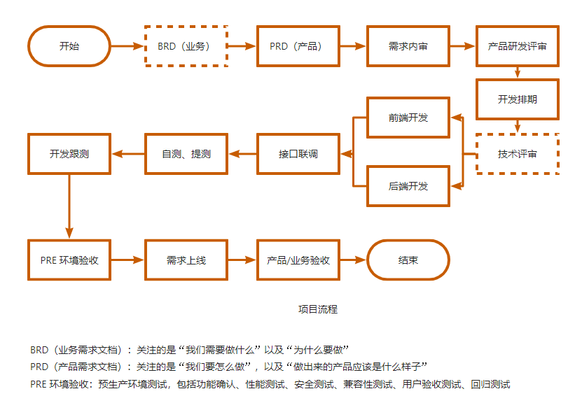
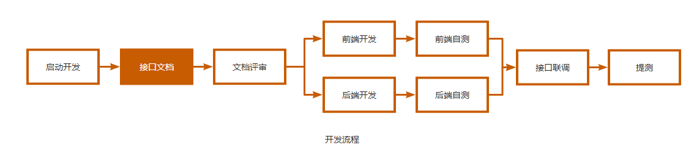

## 1 需求分析

### 1. 项目流程

### 2. 开发流程

* 需求是什么
* 需求要做什么？
* 需求怎么做？

### 3. 概念理解

* 前端、后端
* 前台、中台、后台

### 4. 一套后台管理系统

* 实现登录、欢迎页、工作台、用户、菜单、角色、部门、订单、地图、司机等页面

#### 功能

* jwt 鉴权 -- json web token
* RABC（Role-Based Access Control）：权限控制模型，它根据用户的角色来分配系统访问权限
* 路由守卫
* CRUD - 增删改查操作
* React18
* 文件上传、文件下载
* 自定义 Hook
* 暗黑主题
* 组件封装
* 函数封装
* 架构设计
* ts 开发
* 面包屑
* axios 封装

##### 例子

* 菜单树（递归算法、路径查找）
* 菜单按钮权限

* 百度地图 SDK
* 百度 echarts 图表